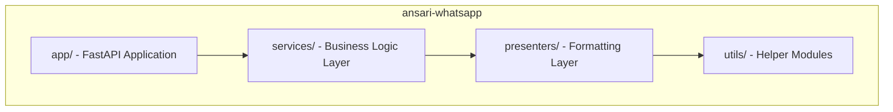
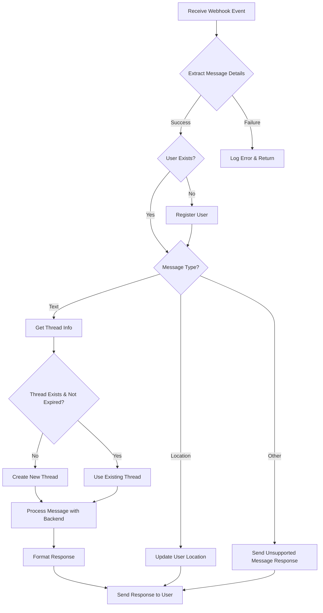
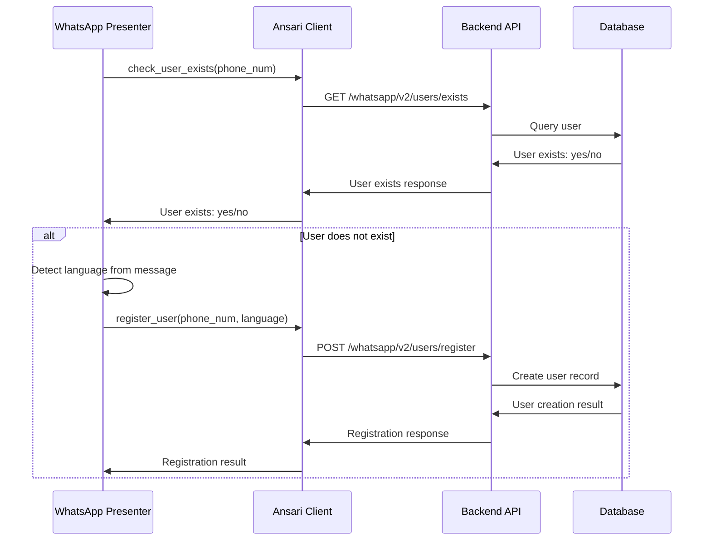

# Ansari WhatsApp Implementation Guide

This implementation guide serves as a comprehensive technical reference for developers working on the Ansari WhatsApp integration. It provides detailed information about the system architecture, code organization, data flows, configuration requirements, and best practices for development. Use this document to understand how the WhatsApp service integrates with the Ansari backend and how to extend, maintain, or troubleshoot the system.

***TOC:***

---
---

- [Ansari WhatsApp Implementation Guide](#ansari-whatsapp-implementation-guide)
  - [Code Structure Overview](#code-structure-overview)
    - [Key Files and Their Responsibilities](#key-files-and-their-responsibilities)
      - [ansari-whatsapp](#ansari-whatsapp)
      - [ansari-backend](#ansari-backend)
  - [Logic Flow in Key Scenarios](#logic-flow-in-key-scenarios)
    - [Handling an Incoming WhatsApp Message](#handling-an-incoming-whatsapp-message)
    - [Registering a New WhatsApp User](#registering-a-new-whatsapp-user)
  - [Key Interfaces and Data Structures](#key-interfaces-and-data-structures)
    - [WhatsApp Webhook Payload Structure](#whatsapp-webhook-payload-structure)
    - [WhatsApp API Endpoints Request/Response](#whatsapp-api-endpoints-requestresponse)
      - [User Registration](#user-registration)
      - [Message Processing](#message-processing)
  - [Environment Configuration](#environment-configuration)
    - [Required Environment Variables](#required-environment-variables)
      - [ansari-whatsapp](#ansari-whatsapp-1)
      - [ansari-backend (WhatsApp-related settings)](#ansari-backend-whatsapp-related-settings)
  - [Debugging Tips](#debugging-tips)
  - [Extending the System](#extending-the-system)
    - [Adding a New WhatsApp Feature](#adding-a-new-whatsapp-feature)
    - [Adding a New Message Type](#adding-a-new-message-type)
  - [Deployment Considerations](#deployment-considerations)
    - [Container Configuration](#container-configuration)
    - [Scaling Strategy](#scaling-strategy)
  - [Security Considerations](#security-considerations)
  - [Troubleshooting Common Issues](#troubleshooting-common-issues)
    - [Webhook Verification Failures](#webhook-verification-failures)
    - [WhatsApp API Errors](#whatsapp-api-errors)
    - [Backend Communication Issues](#backend-communication-issues)

---
---


This guide provides implementation details for developers working with the Ansari WhatsApp service and its integration with the Ansari backend.


## Code Structure Overview

The codebase is organized following a clean architecture pattern:



### Key Files and Their Responsibilities

#### ansari-whatsapp

- **src/ansari_whatsapp/app/main.py**: The FastAPI application entry point
  - Configures and initializes the FastAPI app
  - Defines webhook endpoints for WhatsApp (verification and message handling)
  - Extracts message details through the presenter
  - Routes different message types to appropriate handlers
  - Sends typing indicators to improve user experience
  - Uses FastAPI background tasks for asynchronous message processing

- **src/ansari_whatsapp/services/whatsapp_conversation_manager.py**: Message processing orchestration
  - Orchestrates user registration, thread management, and message processing workflows
  - Manages typing indicators and chat retention (24 hours default)
  - Coordinates between Ansari backend and Meta API services
  - Handles different message types (text, media, location)
  - Implements error handling with context-specific handlers

- **src/ansari_whatsapp/presenters/whatsapp_message_formatter.py**: Message formatting logic
  - Formats AI responses for WhatsApp (4K character limit)
  - Handles markdown to plain text conversion
  - Implements RTL language support (Arabic, Hebrew)
  - Smart message splitting at sentence boundaries
  - Manages response formatting for user-friendly display

- **src/ansari_whatsapp/services/ansari_client_{base,real,mock}.py**: Backend API client
  - Implements API calls to all ansari-backend WhatsApp endpoints
  - Handles user registration, existence checks, thread management
  - Processes messages through the backend with streaming support
  - Features base/real/mock pattern for testing flexibility
  - Robust error handling with context-specific handlers

- **src/ansari_whatsapp/services/meta_api_service_{base,real,mock}.py**: WhatsApp Business API client
  - Sends messages to WhatsApp users via Graph API
  - Manages typing indicators and read receipts
  - Supports base/real/mock pattern for testing
  - Handles WhatsApp API error responses

- **src/ansari_whatsapp/utils/config.py**: Configuration management
  - Defines settings using Pydantic BaseSettings
  - Loads environment variables from .env file
  - Manages secure storage of sensitive tokens
  - Provides type-safe access to configuration values
  - Implements dynamic CORS origin handling based on deployment type

- **src/ansari_whatsapp/utils/whatsapp_webhook_parser.py**: Webhook payload extraction
  - Extracts message details from webhook JSON payloads
  - Supports text messages, locations, and media detection
  - Robust error handling for malformed webhooks

- **src/ansari_whatsapp/utils/whatsapp_message_splitter.py**: Message splitting logic
  - Splits long messages at 4K character boundaries
  - Preserves message coherence and formatting
  - Smart splitting at sentence boundaries

- **src/ansari_whatsapp/utils/language_utils.py**: Language detection utilities
  - Detects RTL languages (Arabic, Hebrew)
  - Determines text direction (LTR vs RTL) based on character analysis
  - Helps with proper formatting of multilingual messages

- **src/ansari_whatsapp/utils/app_logger.py**: Logging utilities
  - Configures enhanced logging with rich formatting using loguru
  - Sensitive data masking for tokens and phone numbers
  - Manages log file handling with rotation and retention
  - Provides standardized logging interface with contextual information
  - Includes rich traceback formatting for improved debugging

#### ansari-backend

- **src/ansari/routers/whatsapp_router.py**: WhatsApp API endpoints
  - Defines routes for WhatsApp-specific operations
  - Handles authentication/validation of WhatsApp service requests
  - Connects to the database and Ansari agent

## Logic Flow in Key Scenarios

### Handling an Incoming WhatsApp Message



### Registering a New WhatsApp User



## Key Interfaces and Data Structures

### WhatsApp Webhook Payload Structure

The WhatsApp service receives webhook events from the WhatsApp Business API in this format:

```json
{
  "object": "whatsapp_business_account",
  "entry": [
    {
      "id": "WHATSAPP_BUSINESS_ACCOUNT_ID",
      "changes": [
        {
          "value": {
            "messaging_product": "whatsapp",
            "metadata": {
              "display_phone_number": "PHONE_NUMBER",
              "phone_number_id": "PHONE_NUMBER_ID"
            },
            "contacts": [
              {
                "profile": {
                  "name": "CONTACT_NAME"
                },
                "wa_id": "CONTACT_WHATSAPP_ID"
              }
            ],
            "messages": [
              {
                "from": "SENDER_WHATSAPP_ID",
                "id": "MESSAGE_ID",
                "timestamp": "TIMESTAMP",
                "type": "text",
                "text": {
                  "body": "MESSAGE_CONTENT"
                }
              }
            ]
          },
          "field": "messages"
        }
      ]
    }
  ]
}
```

### WhatsApp API Endpoints Request/Response

#### User Registration

**Request:**
```json
POST /whatsapp/v2/users/register
{
  "phone_num": "1234567890",
  "preferred_language": "en"
}
```

**Response:**
```json
{
  "status": "success",
  "user_id": "user_uuid_here"
}
```

#### Message Processing

**Request:**
```json
POST /whatsapp/v2/messages/process
{
  "phone_num": "1234567890",
  "thread_id": "thread_uuid_here",
  "message": "User message content"
}
```

**Response:**
```json
{
  "response": "Generated response from the Ansari agent"
}
```

## Environment Configuration

### Required Environment Variables

#### ansari-whatsapp

Check the `.env.example` file in `PROJ_ROOT/` for details about the environment variables required for `ansari-whatsapp`.

#### ansari-backend (WhatsApp-related settings)

No additional WhatsApp-specific environment variables are needed in the backend, as it uses the existing database and agent configurations.

## Debugging Tips

1. Check the logs in both services:
   - ansari-whatsapp logs: `logs/{module_name}.log` (dynamically created per module)
   - ansari-backend logs: `logs/ansari.app.whatsapp_router.log`

2. Use the Rich logging interface to see detailed error information with improved tracebacks.

3. Make API requests directly to the backend endpoints to isolate issues.

4. The loguru-based logging system provides contextual information and detailed tracebacks to help diagnose issues.

5. Use the `LOGGING_LEVEL` environment variable to adjust the verbosity of logs (DEBUG, INFO, WARNING, ERROR).

## Extending the System

### Adding a New WhatsApp Feature

To add a new feature to the WhatsApp integration:

1. Determine if the feature requires backend changes
2. If needed, add new endpoints to `whatsapp_router.py` in the backend
3. Extend the Ansari client in the WhatsApp service to use the new endpoints
4. Implement the feature logic in the WhatsApp presenter
5. Test the integration end-to-end

### Adding a New Message Type

To support a new type of WhatsApp message (e.g., images, documents):

1. Add a new handler method in `whatsapp_presenter.py`:
   ```python
   async def handle_image_message(self) -> None:
       # Implementation here
   ```

2. Add the message type to the main webhook handler in `main.py`:
   ```python
   if incoming_msg_type == "image":
       background_tasks.add_task(
           user_presenter.handle_image_message,
       )
       return Response(status_code=200)
   ```

3. Implement any required backend support in `whatsapp_router.py`.

## Deployment Considerations

### Container Configuration

The Dockerfile in the ansari-whatsapp repository is configured to:
- Use Python 3.10 as the base image
- Install all dependencies from requirements.txt
- Set the appropriate environment variables
- Run the WhatsApp service on port 8001

### Scaling Strategy

The ansari-whatsapp service can be scaled horizontally by deploying multiple instances behind a load balancer. Each instance should be configured with:

1. The same webhook verification token
2. Access to the same ansari-backend API
3. Appropriate logging configuration 


## Security Considerations

1. **API Security**: The WhatsApp API router in the backend should validate requests to ensure they come from authorized WhatsApp service instances.

2. **Webhook Verification**: Use a strong, unique verification token for the WhatsApp webhook.

3. **Environment Variables**: Keep sensitive tokens and credentials in environment variables or a secure secret management system.

4. **Rate Limiting**: Implement rate limiting to prevent abuse of the service.

5. **Input Validation**: Validate all incoming webhook data before processing.

## Troubleshooting Common Issues

### Webhook Verification Failures

- Verify the META_WEBHOOK_VERIFY_TOKEN environment variable matches the token configured in the WhatsApp Business Platform
- Ensure the webhook URL is correctly configured
- Check for any network issues preventing the webhook verification

### WhatsApp API Errors

- Verify the META_ACCESS_TOKEN_FROM_SYS_USER is valid and has not expired
- Check that the META_BUSINESS_PHONE_NUMBER_ID is correct
- Look for any rate limiting or quota issues in the WhatsApp Business Platform dashboard (not likely)

### Backend Communication Issues

- Verify the BACKEND_SERVER_URL is correct and accessible
- Check network connectivity between the WhatsApp service and backend
- Review logs for specific API error responses