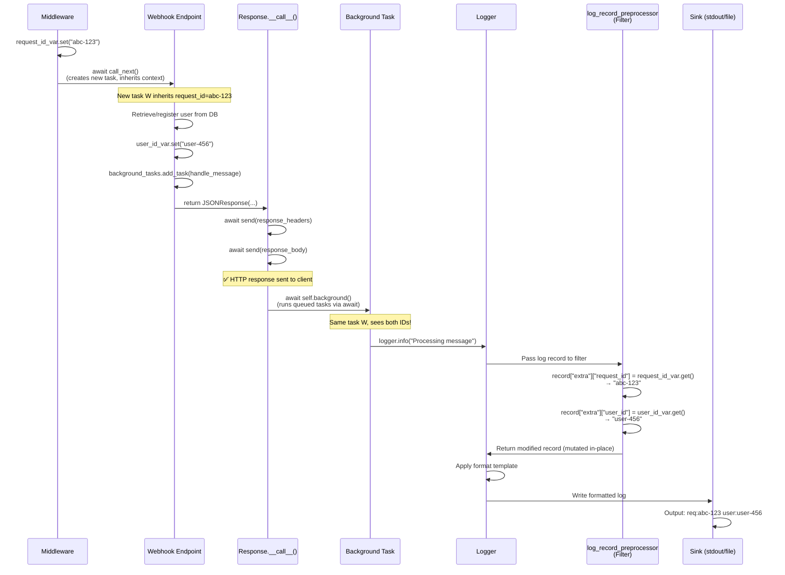

# Logging with Contextvars: Multi-Granularity Log Correlation

## 1. Introduction: The Problem We're Solving

Imagine you're running a web service that processes requests from multiple users. When debugging issues or analyzing behavior, you often need to filter logs at **two different granularities**:

1. **User-level filtering**: See all logs for a specific user across multiple requests
   - Example: Track User Alice's activity across 10 different API calls
2. **Request-level filtering**: See all logs for a single request (trace)
   - Example: Debug exactly what happened during one specific failed request

### Example: What We Want

Consider this scenario with two users (Alice and Bob) making multiple requests:

```
Request 1 (Alice): POST /process → trace_id=abc-123, user_id=alice
Request 2 (Bob):   POST /process → trace_id=def-456, user_id=bob
Request 3 (Alice): POST /process → trace_id=ghi-789, user_id=alice
```

**Desired log output:**
```
[trace_id=abc-123, user_id=alice] Request started
[trace_id=abc-123, user_id=alice] Processing item X
[trace_id=abc-123, user_id=alice] Item X processed
[trace_id=def-456, user_id=bob]   Request started
[trace_id=def-456, user_id=bob]   Processing item Y
[trace_id=ghi-789, user_id=alice] Request started
[trace_id=abc-123, user_id=alice] Request completed ← Background task
[trace_id=def-456, user_id=bob]   Item Y processed
[trace_id=ghi-789, user_id=alice] Processing item Z
```

**Now we can filter:**
- All Alice's logs: `user_id=alice` → Shows requests 1 and 3
- One specific request: `trace_id=abc-123` → Shows just request 1

### The Challenge

To achieve this, we need:
- Both IDs present in **every log line** (including background tasks)
- IDs automatically propagated without manual passing
- Async-safe solution (works with concurrent requests)

To accomplish this, we need to understand:
1. **How logs flow** through Loguru's pipeline (Section 2)
2. **How contextvars work** for async context management (Section 3)

Let's dive in!

---

## 2. Loguru's Logging Pipeline

Every log call goes through three stages:

```
Log Call → [Filter] → [Format] → [Sink]
```

### Stage 1: Filter
- **Purpose**: Decide whether to keep or discard a log
- **Can modify**: Yes! Can add/modify fields in the log record
- **Our use**: Inject `trace_id` and `user_id` from contextvars into `record["extra"]`

### Stage 2: Format
- **Purpose**: Convert log record to a formatted string
- **Example**: `"{time} | {level} | {message} | req:{extra[trace_id]} user:{extra[user_id]}"`
- **Reads from**: `record["extra"]` populated by the filter

### Stage 3: Sink
- **Purpose**: Write the formatted log to a destination
- **Examples**: stdout, file, CloudWatch, Sentry
- **Our use**: Write to stderr (local) or structured JSON (CloudWatch)

### Our Injection Point

We inject context at the **Filter stage** via a custom filter function:

```python
def log_record_preprocessor(record):
    """Inject contextvars into log record before formatting."""
    # Inject from contextvars (explained in the upcoming section ;))
    record["extra"]["trace_id"] = trace_id_var.get()
    record["extra"]["user_id"] = user_id_var.get()

    # Return True to keep the log
    return True
```

This ensures all downstream stages (format & sink) see the IDs!

#### Side Note: How Does the Formatter/Sink See Our Changes?

You might wonder: "We modify `record` in the filter function, but we don't return or pass it anywhere—how do the formatter and sink see these changes?"

The answer lies in **Python's object mutability and pass-by-assignment**:

- `record` is a dictionary (mutable object)
- When Loguru passes `record` to our filter, we receive a **reference** to the original object, not a copy
- When we modify `record["extra"]["trace_id"]`, we're modifying the **original** dictionary
- The formatter and sink later access this **same** dictionary, so they see our modifications

This is why we don't need to return `record` or pass it along—we're editing the shared object in place! [4]

**For a deeper dive:** Check out [Understanding Python's Pass-by-Assignment](https://medium.com/@devyjoneslocker/understanding-pythons-pass-by-assignment-in-the-backdrop-of-pass-by-value-vs-9f5cc602f943) to understand how Python's object reference model enables this pattern.

---

## 3. Understanding Context Variables

Context variables (`contextvars`) are a complex topic that deserves dedicated coverage. Rather than providing a brief overview here, we've created a comprehensive guide that explains:

- What context variables are and why they exist (solving thread-local limitations)
- How they differ from thread-local storage
- How context isolation works in async tasks
- The evolution from PEP 555 → PEP 550 → PEP 567 (final implementation)
- Practical patterns and common pitfalls

**📖 Read the full guide:** [Understanding Context Variables in Python](./understanding_contextvars_in_python.md)

For this logging implementation, the key points you need to know are:

1. **Context variables provide task-local storage** for async code
2. **Spawned async tasks inherit context** at creation time (copy-on-write)
3. **Awaited coroutines share context** with their caller
4. **We use `.set()` to modify context** without context managers

Now let's see how we apply this to our logging system!

---

## 4. How Context Variables Flow Through Middleware, Endpoints, and Background Tasks

### Logical Flow Overview

Here's the high-level execution flow showing where context variables are set and how they propagate:

1. **Middleware Activation**: Custom HTTP middleware intercepts the incoming request
   - A new async task is created by Starlette/FastAPI for the downstream request handler [1]
   - Context variable `request_id` is set using `.set()` method
   - According to PEP 567, new tasks inherit the context at creation time, so `request_id` flows to the endpoint task

2. **Endpoint Handler Execution**: The webhook endpoint processes the request
   - Retrieves or registers the user (e.g., from database)
   - Sets context variable `user_id` using `.set()` method
   - Queues background tasks (e.g., `background_tasks.add_task(handle_message)`)
   - Returns HTTP response (e.g., `JSONResponse`)

3. **Response Lifecycle**: Inside the `Response.__call__()` method [2]
   - First: HTTP response is sent to the client (`await send(...)`)
   - Second: Background tasks are executed (`await self.background()`)
   - **Critical insight**: Background tasks run via `await`, not `asyncio.create_task()`

4. **Background Task Execution**: Tasks run in the **same async context** as the endpoint
   - According to PEP 550: "changes to context variables made in the caller prior to awaiting are visible to the awaited coroutine" [3]
   - Since `user_id` was set before the background task executes (via `await`), it's visible to the task
   - Both `request_id` (from middleware) and `user_id` (from endpoint) are accessible

5. **Logging Filter**: When any log is created, `log_record_preprocessor` filter runs
   - Reads `request_id_var.get()` and `user_id_var.get()` from the current context
   - Injects both values into `record["extra"]` dictionary
   - Formatter and sink see these values in every log line

### Key Principles at Play

- **Middleware creates new task**: FastAPI middleware spawns a new async task for the request handler, which inherits the middleware's context (containing `request_id`) [1]
- **Awaited coroutines share context**: Background tasks run via `await self.background()` inside `Response.__call__()`, so they share the endpoint's context (containing both `request_id` and `user_id`) [3]
- **Filter accesses context**: The logging filter can call `.get()` at any point in the call chain and see the current context values

### Complete Sequence Diagram



**Result**: All logs—including those from background tasks—contain both `request_id` and `user_id` for perfect log correlation!

---

## 6. Alternative Approach: Loguru's `contextualize()` (Failed)

### 6.1 The Medium Article

We initially found this approach in a Medium article:
- **Source**: [Identifying FastAPI Requests in Logs](https://medium.com/gradiant-talks/identifying-fastapi-requests-in-logs-bac3284a6aa)
- **Suggested**: Using `with logger.contextualize(request_id=...)` for request ID tracking

### 6.2 What We Tried

```python
# Approach 1: Middleware (worked ✅)
@app.middleware("http")
async def request_id_middleware(request, call_next):
    with logger.contextualize(request_id=str(uuid.uuid4())):
        response = await call_next(request)
        # Background tasks run INSIDE this 'with' block
        return response
# Result: Background tasks have request_id ✅

# Approach 2: Webhook (failed ❌)
async def main_webhook(...):
    user_id = await get_user()

    with logger.contextualize(user_id=user_id):
        background_tasks.add_task(handle_message)
        return response
        # ← 'with' block exits HERE

# Background tasks run AFTER 'with' block exits
# Result: Background tasks DON'T have user_id ❌
```

### 6.3 Why request_id Worked

The middleware's `with` block wraps the **entire** `call_next(request)` execution, which includes background tasks:

```python
with logger.contextualize(request_id=...):
    response = await call_next(request)  # ← Executes webhook
                                         # ← Sends response
                                         # ← Runs background tasks
                                         # ← ALL inside the 'with' block!
    return response
```

Since background tasks run **before** the `with` block exits, they see the request_id ✅

### 6.4 Why user_id Failed (Hypothesis)

**Our hypothesis**: The `with` block in the webhook exits when the function returns, which happens **before** `Response.__call__()` runs the background tasks.

```python
async def main_webhook(...):
    with logger.contextualize(user_id=user_id):
        background_tasks.add_task(...)
        return response  # ← Function returns
        # ← 'with' block exits HERE
        # ← context.reset(token) called (see 6.5)

# Later (after webhook returns):
# Response.__call__() runs:
await self.background()  # ← 'with' block already exited!
                         # ← user_id was reset, so it's gone!
```

**Why we think this happens**: When the webhook function returns, control goes back to Starlette, which then calls `Response.__call__()`. By that time, the `with logger.contextualize()` block has already exited and reset the context.

### 6.5 Under the Hood: Loguru's `contextualize()`

Here's the actual implementation from Loguru's source code:

**File**: `loguru/_logger.py` (lines 1476-1484)

```python
@contextlib.contextmanager
def contextualize(__self, **kwargs):
    """Bind attributes to the context-local extra dict while inside the with block."""
    with __self._core.lock:
        new_context = {**context.get(), **kwargs}
        token = context.set(new_context)

    try:
        yield  # ← Code inside 'with' block runs here
    finally:
        with __self._core.lock:
            context.reset(token)  # ← RESETS context to previous state!
```

**The critical line**: `context.reset(token)` in the `finally` block **actively restores** the contextvar to its state **before** the `with` block. This is why values disappear after the block exits!

### 6.6 Uncertainty

⚠️ **Important**: While our hypothesis (Section 6.4) makes sense based on our understanding of async execution flow, we're not 100% certain this is exactly what's happening. The interaction between:
- Starlette's middleware wrapping
- FastAPI's response lifecycle
- Loguru's context reset timing
- Background task execution timing

...is complex, and there may be additional factors at play. This explanation is based on the behavior we observed and our best understanding of the code flow.

**Author note**: This hypothesis is proposed by @OdyAsh based on debugging and source code analysis, but further investigation would be needed to confirm the exact timing and mechanism.

---

## 7. Summary & Key Takeaways

### ✅ What Works: Manual ContextVar Management

```python
# In app_logger.py
request_id_var = contextvars.ContextVar('request_id', default='none')
user_id_var = contextvars.ContextVar('user_id', default='none')

# In middleware
request_id_var.set(str(uuid.uuid4()))

# In webhook
user_id_var.set(user_id)

# In filter
record["extra"]["request_id"] = request_id_var.get()
record["extra"]["user_id"] = user_id_var.get()
```

**Why it works:**
- `.set()` without context manager means **no automatic reset**
- Background tasks run in the **same async task**, so contextvars persist
- Filter injects values at log creation time

### 🔑 Key Insight

FastAPI/Starlette runs background tasks in the **same async task** as the request handler (inside `Response.__call__()`). This means:
- Contextvars set via `.set()` persist to background tasks ✅
- But context managers (`with` blocks) that exit before `Response.__call__()` don't ❌

### 📊 Result: Perfect Log Correlation

All logs (including background tasks) now have both IDs for easy filtering:

```
2025-01-15 10:23:45 | INFO | Request started | req:abc-123-def-456 user:none
2025-01-15 10:23:46 | INFO | User identified: user-uuid-789 | req:abc-123-def-456 user:user-uuid-789
2025-01-15 10:23:46 | INFO | Processing message | req:abc-123-def-456 user:user-uuid-789
2025-01-15 10:23:47 | INFO | Message processed | req:abc-123-def-456 user:user-uuid-789
```

**CloudWatch Logs Insights queries:**
```sql
-- All logs for one user (across all their requests)
fields @timestamp, request_id, user_id, level, text
| filter user_id = "user-uuid-789"
| sort @timestamp asc

-- One specific request (granular trace debugging)
fields @timestamp, request_id, user_id, level, text
| filter request_id = "abc-123-def-456"
| sort @timestamp asc
```

---

## Sources

[1] **FastAPI Custom Middleware Task Creation** (DeepWiki)
Understanding how FastAPI/Starlette middleware creates new async tasks for request handlers.
https://deepwiki.com/search/does-fastapi-custom-middleware_b2a4fdf7-29a3-4f3c-b6c9-ed300a63e135?mode=fast

[2] **Identifying FastAPI Requests in Logs** (Medium – Gradiant Talks)
Original inspiration for using context variables to track request IDs in FastAPI applications.
https://medium.com/gradiant-talks/identifying-fastapi-requests-in-logs-bac3284a6aa

[3] **PEP 550 – Execution Context** (peps.python.org)
**Reading Guide**: See "Coroutines and Asynchronous Tasks" section for the principle: "changes to context variables made in the caller prior to awaiting are visible to the awaited coroutine."
https://peps.python.org/pep-0550/

[4] **Understanding Python's Pass-by-Assignment** (Medium)
Explains why modifying the `record` dictionary in the filter function affects the original object seen by formatter and sink.
https://medium.com/@devyjoneslocker/understanding-pythons-pass-by-assignment-in-the-backdrop-of-pass-by-value-vs-9f5cc602f943

---

## Further Readings

**Context Variables Deep Dive:**
- **Understanding Context Variables in Python** (This Repository)
  Comprehensive guide covering what contextvars are, why they exist, and how they work with async tasks.
  [./understanding_contextvars_in_python.md](./understanding_contextvars_in_python.md)

- **PEP 567 – Context Variables** (peps.python.org)
  Final accepted proposal for context variables in Python 3.7+.
  https://peps.python.org/pep-0567/

**Logging with Context Variables:**
- **Log context propagation in Python ASGI apps** (Redowan's Reflections)
  Practical guide on using contextvars with structlog for request tracing.
  https://rednafi.com/python/log-context-propagation/

- **structlog Context Variables Documentation** (www.structlog.org)
  How the structlog library integrates with contextvars.
  https://www.structlog.org/en/stable/contextvars.html

**Framework Documentation:**
- **Loguru Documentation** (loguru.readthedocs.io)
  Official Loguru logging library documentation.
  https://loguru.readthedocs.io/

- **Starlette Middleware** (www.starlette.io)
  Understanding how Starlette (FastAPI's foundation) handles middleware and request lifecycles.
  https://www.starlette.io/middleware/
